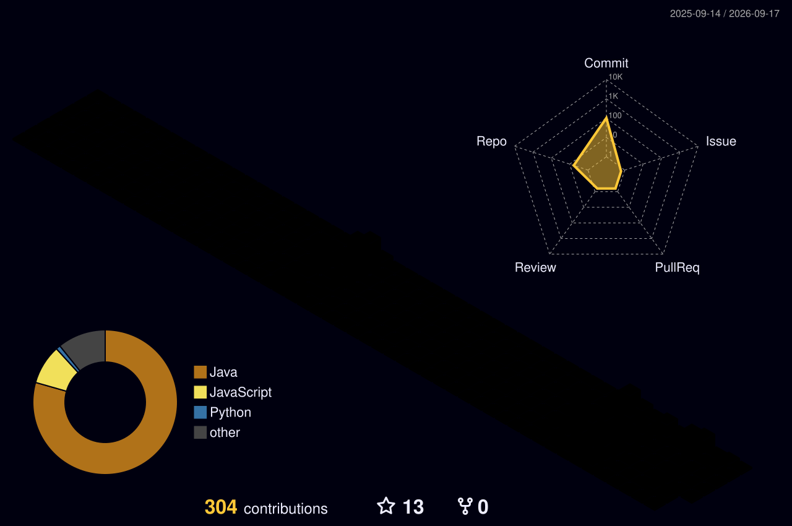

<div align="center">

# Hi, I'm Aditya Sikarwar 👋

### Full Stack MERN Developer • SaaS Builder • Java DSA Enthusiast

I build practical, production-focused web products with clean architecture, secure APIs, and user-friendly interfaces.

[](mailto:asikarwar792@gmail.com)
[](https://www.linkedin.com/in/aditya-sikarwar-866472340/)
[](https://leetcode.com/u/aditya_1231/)
[](https://github.com/Adii123-sik)

</div>

---

## 👨‍💻 About Me

- 💻 Full Stack MERN Developer from **Agra, India**
- 🚀 Built **8 full-stack products**, with **5+ deployed for real-world use**
- 🧩 Interested in **SaaS, multi-tenant systems, booking automation, billing systems, dashboards and APIs**
- 🌱 Currently improving **System Design, NestJS, Advanced DSA and scalable backend architecture**
- ☕ Solving DSA in **Java** and strengthening problem-solving fundamentals
- 🤝 Open to meaningful **MERN, SaaS and open-source collaborations**
- 📫 Reach me at **[asikarwar792@gmail.com](mailto:asikarwar792@gmail.com)**

> **Build useful things. Keep learning. Ship better software.**

---

## 🛠️ Tech Stack

<div align="center">

### Languages


### Frontend


### Backend & Databases


### Tools & Platforms


</div>

---

## 🚀 Featured Work

<table>
<tr>
<td width="50%" valign="top">

### 🏥 Doctor Appointment SaaS
**React.js · Node.js · Express.js · MySQL · Razorpay**

Multi-tenant hospital appointment and reception platform with QR booking, WhatsApp-based flows, online payments, OPD tokens and live queue tracking.

</td>
<td width="50%" valign="top">

### 📦 Mica Manager
**Next.js · TypeScript · NestJS · MySQL · JWT**

Wholesale inventory, billing and ledger system with credit sales, partial payments, receivables/payables and Excel import workflows.

</td>
</tr>

<tr>
<td width="50%" valign="top">

### 📢 Brandcrest Media Platform
**React.js · TypeScript · Node.js · Express.js · MySQL**

Advertising booking platform for multiple media channels including newspaper, radio, cinema, transit, mall, outdoor and television campaigns.

</td>
<td width="50%" valign="top">

### 🏭 Inventory Management System
**Full Stack · Role-Based Access**

Inventory workflow built for **509 Army Base Workshop, Indian Army**, replacing a manual paper-based stock tracking process with a structured digital system.

</td>
</tr>
</table>

---

## 🧠 Problem Solving

<div align="center">

### LeetCode

<a href="https://leetcode.com/u/aditya_1231/">
  
</a>

</div>

- ✅ **100+ Java DSA problems solved**
- 📚 Practicing arrays, strings, hashing, two pointers, sliding window, recursion and other core patterns
- 🎯 Focus: write correct solutions first, then improve time and space complexity

---

## 📊 GitHub Overview

> These cards are generated inside this repository by GitHub Actions, so they do not depend on the public `github-readme-stats.vercel.app` endpoint.

<div align="center">




</div>

---

## 🌌 3D Contribution Graph

<div align="center">



</div>

---

## 🐍 Contribution Snake

<picture>
  <source media="(prefers-color-scheme: dark)" srcset="https://raw.githubusercontent.com/Adii123-sik/Adii123-sik/output/github-contribution-grid-snake-dark.svg" />
  <source media="(prefers-color-scheme: light)" srcset="https://raw.githubusercontent.com/Adii123-sik/Adii123-sik/output/github-contribution-grid-snake.svg" />
  
</picture>

---

## 🎯 What I'm Learning Now

```text
System Design       → scalable services, caching, queues, database choices
NestJS              → modular backend architecture and clean APIs
Advanced DSA        → stronger problem solving and interview preparation
Backend Engineering → authentication, authorization, payments and reliability
```

---

## 🤝 Let's Connect

<div align="center">

**I'm interested in building useful products, learning from strong engineers, and collaborating on real software.**

[Email](mailto:asikarwar792@gmail.com) •
[LinkedIn](https://www.linkedin.com/in/aditya-sikarwar-866472340/) •
[LeetCode](https://leetcode.com/u/aditya_1231/) •
[GitHub](https://github.com/Adii123-sik)

<br/><br/>


</div>

---

<div align="center">

### “An investment in knowledge pays the best interest.” — Benjamin Franklin

**Thanks for visiting my profile. ⭐**

</div>
